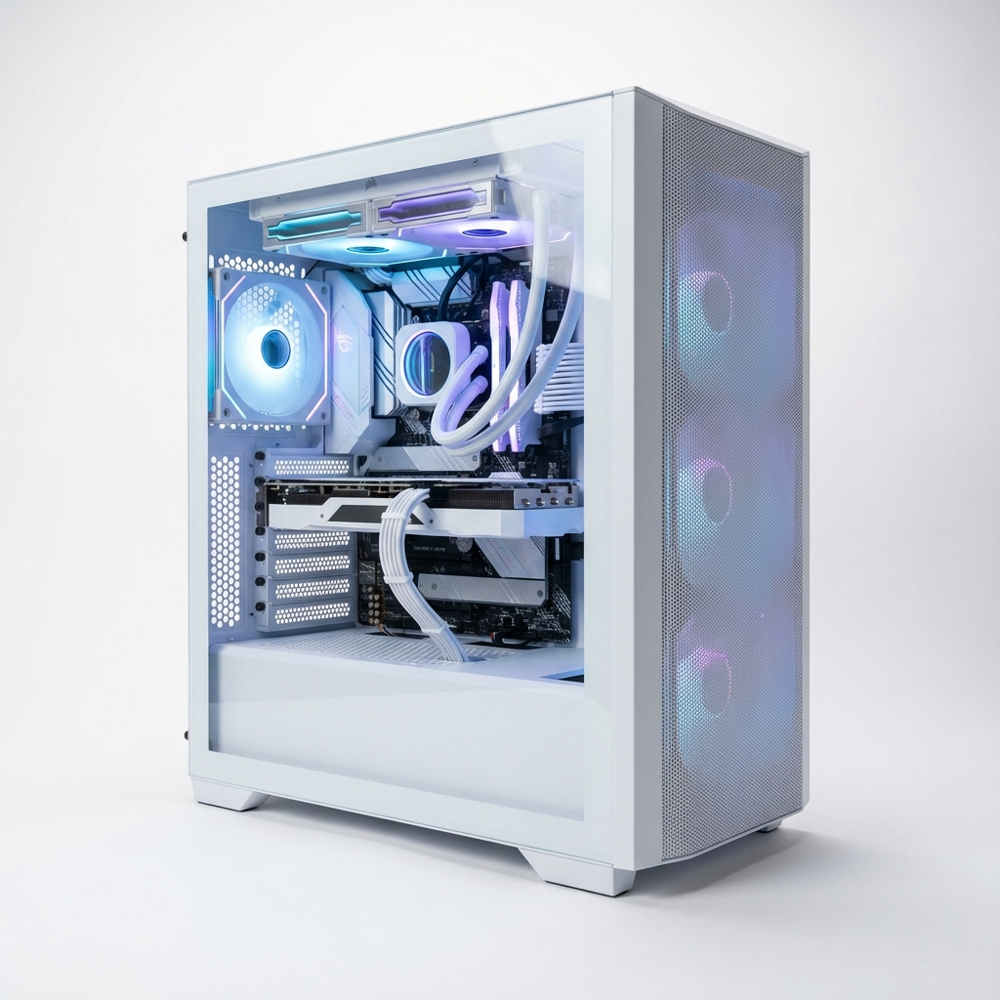

# Evertide - Craft Your Legend



Evertide is a modern, premium frontend web application designed for a high-end online computer part and custom PC build shop. Featuring a striking Bento-style UI, glassmorphism aesthetics, and meticulously crafted animations, Evertide brings next-gen hardware to life with a fully immersive browsing experience.

> **Note:** This project is a pure frontend implementation built as a homework assignment for a Web Programming I course. It currently operates without a backend database.

## Features

Evertide has been built around a clean, visually dynamic user experience prioritizing performance and design:
- **Immersive UI/UX:** 
  - Dark-mode aesthetics using custom-tailored glassmorphism panels.
  - Smooth page transitions and micro-animations upon scroll.
  - Fully responsive grid layout powered by Tailwind CSS.
- **Store & Product Catalog:** Browse curated, high-performance PC components, complete with dynamic product loading and category filtering (GPUs, CPUs, Cases).
- **Custom PC Builder Flow:** Prominent calls-to-action guiding users to start their ultimate custom build.
- **8 Distinct Pages:**
  - **Home:** Hero section, animated feature grid, statistics, FAQ preview, and newsletter subscription form.
  - **Store:** Product catalog demonstrating category filtering capabilities.
  - **About:** The story, mission, and guarantees behind Evertide.
  - **Cart:** Shopping cart management with interactive frontend logic.
  - **Contact:** Get in touch with customer support.
  - **FAQ:** A comprehensively designed Frequently Asked Questions page.
  - **Login & Register:** Beautifully styled user authentication interfaces.
  - **Payment:** A dedicated checkout and secure payment processing mockup page.

## Technologies Used

This project was built from scratch leveraging modern web development tools:
- **HTML5:** Semantic and accessible HTML structure.
- **Tailwind CSS (via CDN):** Utility-first CSS framework for rapid, responsive UI development.
- **Vanilla JavaScript:** Powers interactive DOM manipulation, page transitions, responsive scroll navigation, filtering logic, and cart state management.
- **Custom CSS Keyframes:** Enhances interactions with fade-ins, slide-ups, and pulsating glow effects.

## Project Structure

```text
Evertide/
├── assets/
│   ├── images/      # Product images, icons, and hero graphics (e.g., case.png)
│   └── js/          # JavaScript logic
│       ├── home.js
│       ├── cart.js
│       └── transition.js
├── pages/           # HTML templates for the different views
│   ├── about.html
│   ├── cart.html
│   ├── contact.html
│   ├── faq.html
│   ├── login.html
│   ├── payment.html
│   ├── register.html
│   └── store.html
├── index.html       # Main landing page
└── README.md        # Project documentation
```

## Getting Started

Because this is a purely frontend project, running it is incredibly simple without complex server requirements.

1. **Clone the repository:**
   ```bash
   git clone https://github.com/your-username/evertide.git
   ```
2. **Open the project:**
   Navigate into the downloaded folder and open `index.html` in your preferred web browser. 
3. **Optional (Live Server):** 
   For an optimal development experience, serve the directory using a local web server (like the "Live Server" extension in VS Code) to test absolute paths and simulated local fetch requests if added later.

## Responsiveness

Evertide has been rigorously styled to adapt fluidly to multiple screen sizes:
- **Desktop & Laptops:** Full grid layouts with hover micro-animations.
- **Tablets:** Adaptive column adjustments ensuring readability.
- **Mobile Devices:** Stacked layouts with touch-friendly navigation components.

## Custom Modifications

If you want to tweak colors or typography, the base Tailwind configuration is embedded directly within the `<script>` tag inside the `<head>` of `index.html`. You can globally alter brand colors, fonts, or keyframe animations from this single configuration block.

!!!!!!!!!!!!!!!! THIS PROJECT HAS BEEN CREATED AS AN EXAMPLE FOR A UNIVERSITY HOMEWORK. !!!!!!!!!!!!!!!!